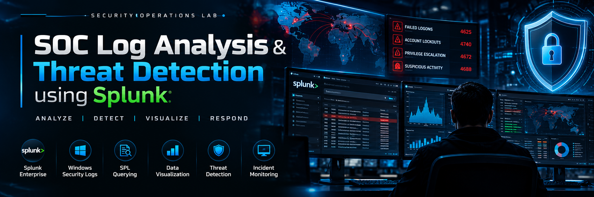
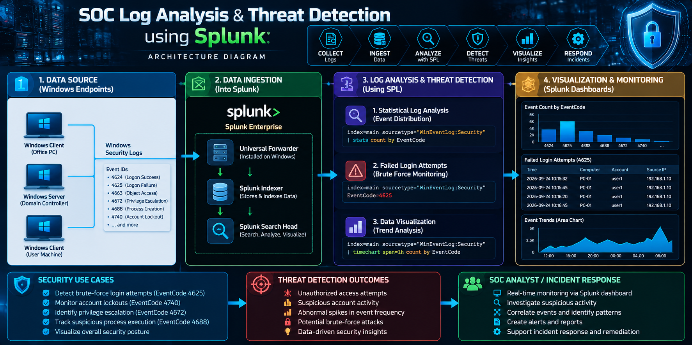
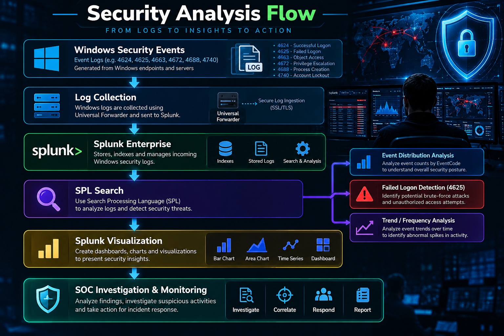
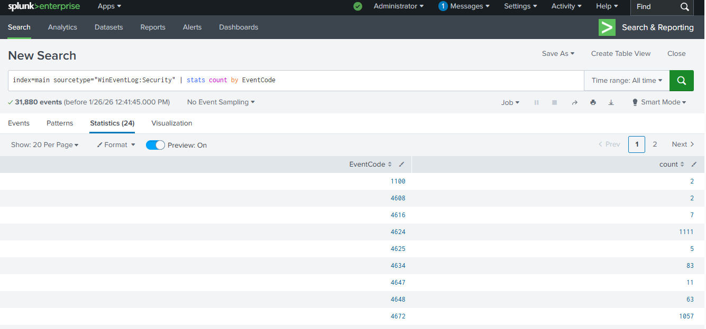
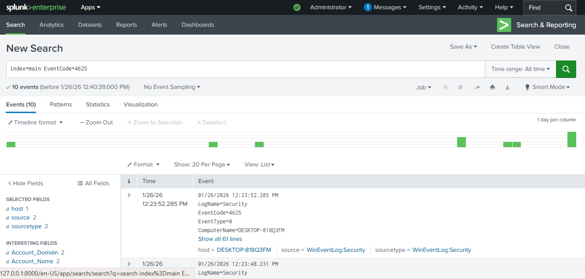
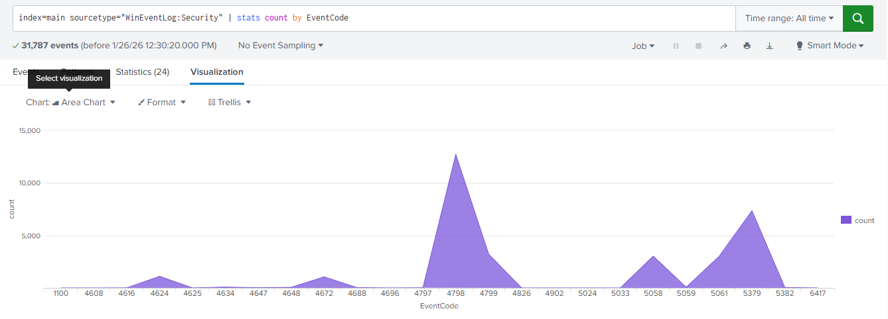

<!-- =========================================================
SOC Log Analysis & Threat Detection using Splunk
GitHub README — Professional / Senior-Engineer Style
========================================================= -->

<div align="center">



<br>

<div align="center">


</div>

**Analyze • Detect • Visualize • Respond**

</div>

---

## 📌 Project Overview

This project demonstrates practical **Security Information and Event Management (SIEM)** capabilities using **Splunk Enterprise** to analyze Windows Security Event Logs.

The lab follows a practical SOC workflow: ingest raw security telemetry, perform structured log analysis with **Search Processing Language (SPL)**, identify suspicious authentication activity, and transform event data into visual insights that support security monitoring and investigation.

> **Core security objective:** turn raw Windows security telemetry into actionable evidence for threat detection and SOC investigation.

---

## 🎯 Objectives

- Ingest and search Windows Security Event Logs in Splunk Enterprise.
- Analyze event distributions using SPL statistical functions.
- Isolate **EventCode 4625** (failed logon) activity for investigation.
- Identify patterns that may indicate unauthorized access or brute-force activity.
- Visualize event frequency to improve monitoring and anomaly awareness.
- Demonstrate an end-to-end SIEM analysis workflow suitable for SOC operations.

---

## 🏗️ Architecture

The architecture below shows the security telemetry flow from Windows endpoints into Splunk, through analysis and detection, and finally into visualization and SOC investigation.

<div align="center">



</div>

### 🔄 Security Analysis Flow


 
---

## 🛠️ Tools & Technologies

| Area | Technology / Skill |
|---|---|
| SIEM | **Splunk Enterprise** |
| Data Source | **Windows Security Event Logs** |
| Sourcetype | `WinEventLog:Security` |
| Query Language | **Search Processing Language (SPL)** |
| Detection Focus | Failed authentication / suspicious access attempts |
| Visualization | Splunk charts and trend analysis |
| SOC Skills | Log analysis, event correlation, monitoring, investigation |

---

## 🔐 Detection & Analysis Workflow

### 1. Statistical Log Analysis

The first step was to establish an event-level view of the security telemetry by aggregating logs according to their unique **EventCode** values.

```spl
index=main sourcetype="WinEventLog:Security"
| stats count by EventCode
```

This provides a quick baseline of event frequency and helps identify which security event types deserve deeper investigation.



**Figure 1 — Event distribution by Windows Security EventCode.**

---

### 2. Failed Login Monitoring — EventCode 4625

Windows **EventCode 4625** represents a failed logon event. Repeated failures can provide useful evidence when investigating possible unauthorized access or password-guessing activity.

```spl
index=main EventCode=4625
```

This filter isolates failed authentication events so that the analyst can examine the affected accounts, hosts, timing, and other available event fields.



**Figure 2 — Failed logon activity filtered with EventCode 4625.**

> ⚠️ **Detection note:** a failed login by itself does not prove a brute-force attack. Repeated events, timing, account context, source information, and correlation with additional telemetry should be considered during investigation.

---

### 3. Data Visualization

Raw event counts were transformed into an **Area Chart** to make changes in event frequency easier to identify and investigate.

Visualization helps a SOC analyst move from individual events toward **time-based patterns**, including unusual spikes or shifts in system activity.



**Figure 3 — Event frequency visualization using an Area Chart.**

---

## 🧠 Detection Engineering Perspective

The lab demonstrates a simple but reusable detection workflow:

```text
COLLECT
   ↓
NORMALIZE / INDEX
   ↓
SEARCH WITH SPL
   ↓
FILTER SECURITY-RELEVANT EVENTS
   ↓
IDENTIFY PATTERNS
   ↓
VISUALIZE
   ↓
INVESTIGATE
```

This approach reflects a core SOC principle: **security monitoring starts with reliable telemetry, but detection value comes from how that telemetry is queried, contextualized, and interpreted.**

---

## 📊 Key Security Use Case

### Potential Unauthorized Access / Brute-Force Monitoring

**Telemetry:** Windows Security Event Logs  
**Event of interest:** `4625` — failed logon  
**SIEM:** Splunk Enterprise  
**Analysis method:** SPL filtering and event inspection  
**Investigation goal:** identify repeated or suspicious authentication failures that may warrant further investigation.

---

## 🧩 Skills Demonstrated

- **SIEM Operations** — working with security telemetry inside Splunk.
- **Log Analysis** — understanding event distributions and security-relevant records.
- **SPL Querying** — filtering and aggregating event data.
- **Threat Detection** — identifying indicators that may represent suspicious access activity.
- **Data Visualization** — converting event telemetry into monitoring-friendly views.
- **SOC Investigation** — using event evidence to support further analysis.

---

## 📁 Suggested Repository Structure

```text
.
├── README.md
├── S-1.png
├── S-2.png
├── S-3.png
└── assets/
    ├── splunk-soc-banner.png
    └── splunk-soc-architecture.png
```

> Keep the three original evidence screenshots (`S-1.png`, `S-2.png`, `S-3.png`) in the repository root, or update the image paths above if you prefer an `evidence/` directory.

---

## ✅ Project Outcome

This lab demonstrates a complete introductory **SIEM threat-analysis workflow** using Splunk Enterprise:

**Windows Security Logs → SPL Analysis → Detection → Visualization → Investigation**

The project provides hands-on evidence of practical skills in **SOC monitoring, log analysis, SPL querying, security-event investigation, and threat-focused visualization**.

---

## 🧪 Engineering Takeaways

1. **Telemetry is the foundation of detection.** Without usable security logs, reliable analysis is not possible.
2. **Queries turn telemetry into evidence.** SPL enables analysts to reduce large event streams into security-relevant findings.
3. **Context matters.** A single event should be interpreted alongside repetition, timing, host/account context, and additional indicators.
4. **Visualization accelerates investigation.** Trends and spikes are easier to recognize when event data is represented visually.
5. **Detection is an iterative process.** Initial filters can evolve into correlation rules, thresholds, alerts, and automated response workflows.

---

## ⚠️ Security & Lab Disclaimer

This project is intended for **authorized lab, educational, and defensive security-monitoring environments only**. Do not use the techniques or telemetry analysis described here against systems you do not own or have explicit permission to monitor.

---

## 👨‍💻 Author

**Amal Udayanga Basnayake**  
IT & Systems Specialist | Cybersecurity | Azure Security | SIEM & Threat Detection

[](https://github.com/AmalUBasnayake)

---

<div align="center">

### 🔒 SECURITY OPERATIONS LAB
**Analyze. Detect. Investigate. Improve.**

</div>
